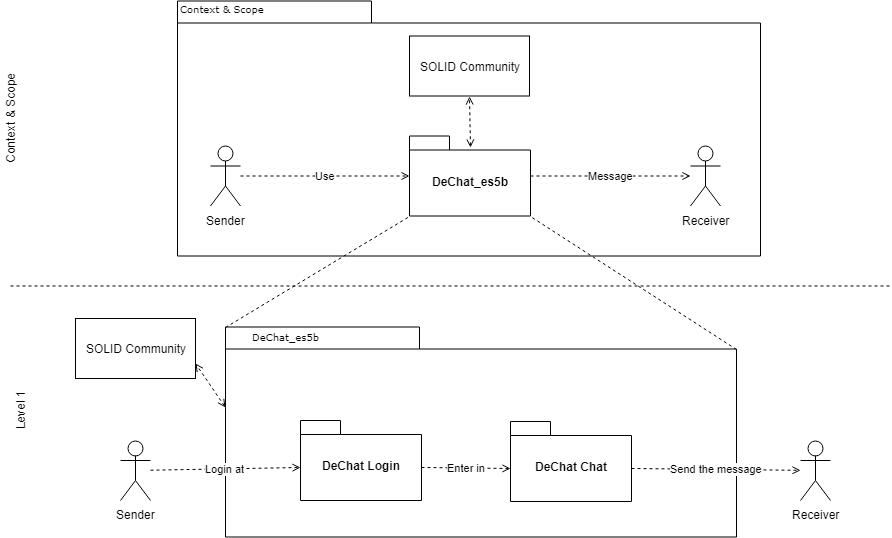

[[section-building-block-view]]

== Building Block View
The building block view shows the static decomposition of the system into building blocks as well as their dependencies.

=== Whitebox Overall System

We have two views, the main one (index.html), which is the one used to perform the user's logging, and the secondary one (two-people-chat.html) which purpose is to make possible the chat between two people.

It is necessary to incorporate the login module since the application is customized according to the logged user. For example, the friends list will not be the same for all users, but each user will have their own friends list.

Contained building blocks::
[cols="1,2" options="header"]
|===
| Name | Responsibility
| DeChat_es5b | It represents the application and allows the user to chat with any other person.
|===

==== Level 1

This level specifies the main views with which the user will interact. 

Contained building blocks::
[cols="1,2" options="header"]
|===
| Name | Responsibility
| index.html | The purpose of this box is to let the user log in with his own user account, so it allows him obtain an experience of the application as personalized as possible.
| two-people-chat.html | The purpose of this box is to ensure that two users can communicate by chatting.

The user interface will show a side navigation bar showing the friends of the authenticated user with whom he can chat.

The interface also shows a panel in which the conversation is shown in real time.
| index.js | Both principal viewa contain the index.js script. This script contains all the application functionality, which is specified on level 2.
|===

==== Level 2

This level contains the application core information. All the functionality of the script index.js.

Contained building blocks::
[cols="1,2" options="header"]
|===
| Name | Responsibility
| main.js | It is the main script of the hierarchy. Its task is to bring together all the main functionalities.

| LogInManager.js | It is the script in charge of the functionality that has to do with the user's login.

| popup.html | This is the corresponding view with the pop-up window that appears when you try to log in to the application.

| ChatManager.js | The script in charge of all the functionality pertaining to the sending and receiving of messages between users.

| NotificationManager.js | It is the script which purpose is to add the notifications functionality to the chat.

| PodUtilities.js | It implements an adapter by adding functionality to the solid-file-client library. It is used by all scripts in the logic layer to communicate with PODs.
|===
