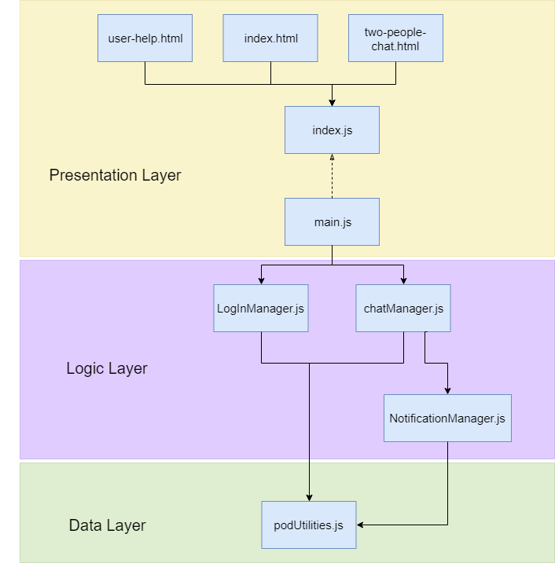

[[section-concepts]]
== Cross-cutting Concepts

=== User Experience concepts (UX)
==== User interface:
We have implemented a user interface using the bootstrap library. It's composed of two main pages: login page and chat room. The interface prototype is shown in the next prototype:

image::images/05_chat_room_sketch.png["Chat room interface"]

==== Internacionalization:
DeChat ES5B is internationalized. At this moment, you can browse our chat in English (default), Spanish, Chinese (Simplified) and Galego.

A browser-based system were implemented. This means that you do not need to reaload the whole page to change language.

=== Design patterns
==== Design Pattern: Adapter
To implement the solid-file-client library (which allows us to communicate with the PODs) we have made use of an adapter that adds functionality to the initial library.
The Adapter is called PodUtilities. The solid-file-client library is imported  in this class and it is called by the logic classes to communicate with the PODs and get the data.

image::images/08-Adapter.png["Adapter pattern"]

==== Architectural pattern: Three-tier architecture
We have separated architecture into layers of presentation, logic and persistence. The implementation of the previous architecture has been carried out following the following diagram below:

=== Development concepts
==== Test
We have developed an extensive and exhaustive test layer that can be launched by following the steps indicated in the readme.

==== Deploy
The chat application is displayed on the page associated with the git repository. It can be accessed from the following https://arquisoft.github.io/dechat_es5b/[deChat_es5b].

image::images/08-Crosscutting-Concepts-Structure-EN.png["Possible topics for crosscutting concepts"]
