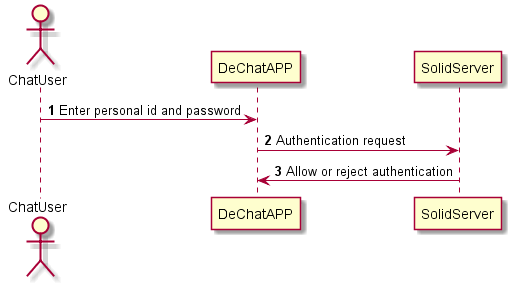

[[section-runtime-view]]
== Runtime View

[role="arc42help"]
In this section, we will develop the main runtime views of use cases of our application. In this version 0.1 of the documentation, the diagrams will be not very specific.

We will improve and better specify the diagrams in following versions of the application and documentation.

=== Log in
The login process will be done by users when they log in with their pesonal id to access the chat.

1. The user must enter his or her personal ID and password.
2. The application asks the server to approve the login request.
3. The server approves the login or denies it. If accepted the user can access the chat.

=== Add new friends
The users must have friends in the chat in order to chat with them.

When the user signs up for the chat, he won't have any friends yet. Here we'll show the sequence diagram to be able to add a friend.

1. The user must enter the url of the pod of the user who wants to add as a friend.
2. The friend's url is stored on his pod so he can chat.

image::./images/addfriend.png[Add new friend diagram]

=== Chat with added friends
The users use the application to chat with their friends. Here we will explain the sequence for send messages.

1. User 1 sends the message to user 2.
2. The application of user 1 post the message on the user 2's pod.
3. User 2's application requests received messages to the pod. The pod makes them available to the application.
4. User 2 reads the recieved messages from the application.

image::./images/messages.png[Exchange messages diagram]
